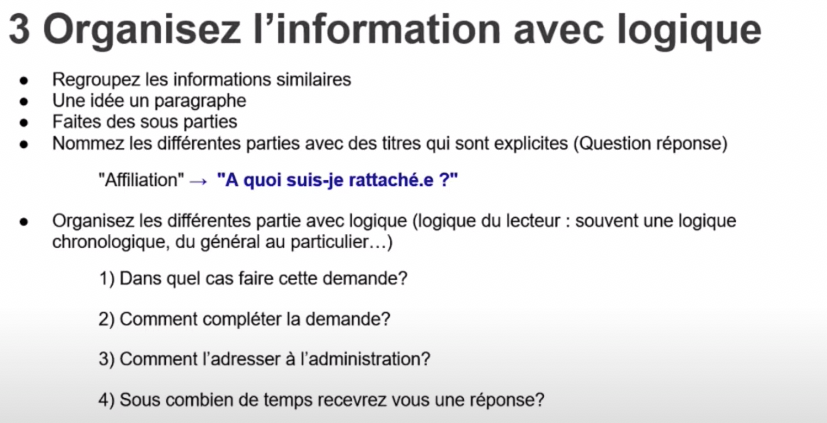

# Simplifier l'information à destination des utilisateurs

Autre ressource : [https://www.gouvernement.fr/charte/charte-des-grands-principes-redactionnels/a-faire-a-ne-pas-faire](https://www.gouvernement.fr/charte/charte-des-grands-principes-redactionnels/a-faire-a-ne-pas-faire)&#x20;

### **Lien vers le replay ici :** [**https://www.youtube.com/watch?v=7scX1FO\_FQM**](https://www.youtube.com/watch?v=7scX1FO_FQM)&#x20;

### **A FAIRE quel que soit le type et le média du message utilisé :**&#x20;

#### Prendre en compte les <mark style="color:yellow;">caractéristiques cognitives des usagers</mark> : sont-ils jeunes ?âgés ?etc

#### Prendre en compte <mark style="color:yellow;">leurs contraintes</mark> :&#x20;

* **manque de temps**

(Le temps de l'utilisateur est compté, autant lui faciliter la tâche dans sa lecture en limitant ses efforts de compréhension)

* **attention limitée**&#x20;

_(si le message est trop long ou confus, il ne sera pas lu)_

* **capacité de traitement limitée**&#x20;

_(attention à ne pas donner trop d'infos dans 1 seul message)_

* **fatigue cognitive**&#x20;

_(Ex : envoyer un mailing non urgent à 17h en semaine)_

* **biais cognitifs**

_(ce qui est logique pour moi en tant qu'expert technique ou métier, ne l'est pas forcément pour l'utilisateur)_

### Les freins à une meilleure communication&#x20;

<mark style="color:yellow;">La "malédiction de la connaissance"</mark> =  _" Tout le monde connait le concept"_

<mark style="color:yellow;">L'aversion au risque</mark>  = _"Plus je donne d'info, mieux ce sera"_ (produit l'effet inverse)

<mark style="color:yellow;">Le biais du statut quo</mark> = _"On a toujours fait comme ça donc pourquoi changer ?"_

De manière générale aujourd'hui, il y a une <mark style="color:yellow;">**surcharge attentionnelle**</mark> (tout le monde est sollicité tout le temps par le téléphone, les mails, les notifications diverses, etc.)

### Les solutions

.png>)

.png>)

.png>)

.png>)
