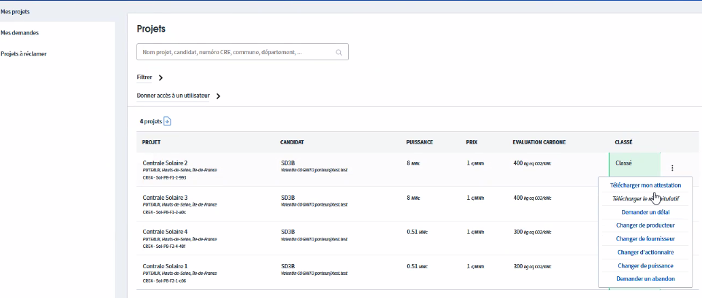

# Faire une démo de Potentiel

Ceci est une page permettant de retrouver l'ensemble des démos de Potentiel par profil d'utilisateur.



\
\
2\. Traitement de la GF à valider (PP dépose un document)&#x20;

3\. Réception d'une demande de changement de projet (PP demande un changement)

3\. Réception d'une information au préfet



1.  Connexion (2 types)&#x20;

    **Invitation :** \
    1\) lauréat 2) invitation par collègue  3) invitation à consulter un projet historique \
    **Connexion libre depuis la page :**&#x20;
2. Déposer un document (Garanties financières)
3. Faire une demande de changement de projets ou informer le préfet
4. Demander l'application du cahier des charges modifié
5. Donner accès à un autre utilisateur&#x20;
6. Réclamer des projets historiques \
   "Pré-affecté" est fonction de l'adresse mail choisie. Si différente, le projet ne s'affichera pas.\
   Demande de saisie des données de prix et numéro CRE.\
   Import de l'attestation 







.png>)

.png>)

.png>)

.png>)

pour faie une demande coté PP : Pfaire&#x20;

Renvoi vers la page d'aide pour choix ancien ou nouv CDC :&#x20;

.png>)

.png>)

.png>)
